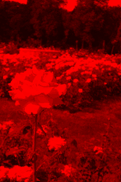
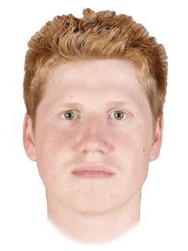
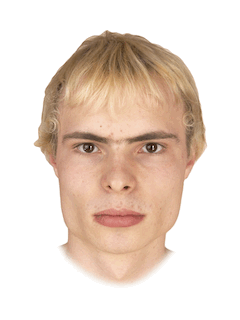

# COSC 101 Homework 7: Fall 2020

The due date for this homework is **Friday, October 30, 7:00pm**.

This homework will improve your skills with nested `for` loops, functions and modules by having you develop programs that use nested loops to repeat code patterns that are similar but not exactly the same. Your program will uses the `cImage` module, [described in the textbook](https://runestone.academy/runestone/books/published/thinkcspy/MoreAboutIteration/ImageProcessingonYourOwn.html). Specifically, this assignment is designed to give you practice with the following topics:

- Nested for loops
- Functions
- Modules

To get started, download [`hw7.zip`](hw7.zip) and unzip the compressed file to reveal the following files:

- `hw7_images.py` this file will be used for all of your code
- `cImage.py` an image manipulation module described in the textbook and used by your program
- `img` a folder of images you can use to test your `hw7_images.py` program

Note that all starter files have special headers at the top including form fields that you should fill out before submitting your assignment. Also, do not change the file names as the test program included with this homework (and test programs that we use) assume certain file names.

## Part 1: Image effects

Your first task is to write two functions that manipulate digital images.

Open and attempt to run the `hw7_images.py` file in IDLE. Note that the `cImage.py` module described in the textbook has been included in the zip file for this homework; the `hw7_images.py` file uses this module to manipulate and display the images. Note that to close the image window, you can just click anywhere on it.

You will write all of your code for this part of the homework in the `hw7_images.py` file. Carefully read through all of the comments in the file to make sure you understand what sections of the file you do not need to modify and where your code should go.

We have provided three image file examples that you can work with for this assignment: `colgate.gif`, `rose.gif`, and `grid.gif`. It is strongly recommended that you test your code with multiple images to help ensure that it works for any image.

&nbsp;

You will write **two functions** that take an image object, create a copy, perform a pixel-by-pixel manipulation, and return the manipulated copy. We have provided three helper functions (`open_image`, `display_image`, and `save_image`) that you can use to test your code. You may write any additional helper functions that you find useful. Below there are descriptions and sample images for each of the required manipulations.

The best way to test your image functions is to modify the `main` function at the bottom of `hw7_images.py`. You can add calls to the various image functions and use the helper functions to display and save the new/modified image.

The code for an example function, `red_filter`, is provided in `hw7_images.py`; images to show the effect of this filter are shown below.

The two functions you must write are as follows:

### 1. `negative`
Create a negative of the image by inverting all of the color values. Recall that the minimum color value is `0` and the maximum is `255`. So a color value of `255` becomes `0` and a value of `33` becomes `222`.

&nbsp;

### 2. `flip_horizontal`
"Flip" the image horizontally so that pixels on the left column and right column are swapped, pixels on the second column and next-to-last column are swapped, etc.

&nbsp;

## Part 2: Image merge

Your second task is to write a function to merge multiple images to create a single average image. This technique is used by researchers in a number of different fields. For example, [psychologists have found](https://www.theguardian.com/lifeandstyle/2015/oct/18/why-we-find-average-faces-most-attractive) that people find averaged faces to be more attractive than the individual faces that make up the average. And artificial intelligence researchers use many images to automatically generate new images. For example, see these websites that use AI to generate images of imaginary [people](https://www.thispersondoesnotexist.com/), [cats](https://thiscatdoesnotexist.com/), and [art](https://thisartworkdoesnotexist.com/).

You are to create a function called `merge` which takes four image objects as parameters and returns an image object which is the average of those four images. You can assume that all images passed to the function will have the same dimensions. Each pixel color in the merged image should be the average of the pixel colors at that position in the four given images.

For example, given the following four faces:

&nbsp;

This averaged face is created:

&nbsp;

**Note: You can modify the main function to display the merged faces, but you
will not be able to save the merged faces image, because the cImage library
only supports saving images with fewer than 256 unique colors.**

The above four face images have been included in the `img` folder provided with this homework. You can download a .zip file containing more faces to try [here](faces.zip). These faces come from a [dataset](https://osf.io/a3947/) released by the team from University of Glasgow. They have [a website](http://faceresearch.org/demos/average) where you can select photos of people and view the average of those faces.

This problem is based on an assignment created by Evan Peck at Bucknell University.

## Challenge Problem

Challenge problems are entirely optional extensions to the homework. If you complete them successfully, you are rewarded with a sense of accomplishment and a small number of extra points on the homework. They are intended for students who want to explore a little further; only pursue the challenge problem after you have successfully completed the homework.

For this week, the challenge problem is to create your own image manipulation. For inspiration, you can investigate different filters and manipulations in apps or programs that modify photos. You can also create a new image by combining the various functions you've written for image manipulation.

If you choose to do the challenge problem, please write your additional function in the file `hw7_images.py`. The function should be called `challenge`, be sure to explain what your function does in the docstring! Have fun!

# Submission Instructions

Submit your completed assignment on [Moodle](https://moodle.colgate.edu) under your course section's homework 7. You should upload only your `hw7_images.py` file. Remember to complete the questions at the top of the provided files and that the files you submit need to have these exact filenames.

# Grading

Your assignment will be graded on two criteria:

1. Correctness: Be sure that you run your programs and make sure they work correctly. Be sure to test more than one image to verify that the image transformation works for other inputs, too --- you can be sure that we will do that! [80%]

    The correctness part of your grade is broken down as follows:

    | Category | Portion of grade |
    | --- | --- |
    | Part 1 (image manipulation) | 40% |
    | Part 2 (image merge) | 40% |

2. Program design and style [20%]: style and program design become
    increasingly important the more complex your program becomes. For
    these programs, adhere to the following guidelines:

    -   Variable names should be meaningful

    -   Programs should contain at least a few descriptive comments. Do
        *not* comment every line of code with low level explanations of
        what each line does. Focus on high level ideas.

    -   Any functions must have appropriate docstrings
