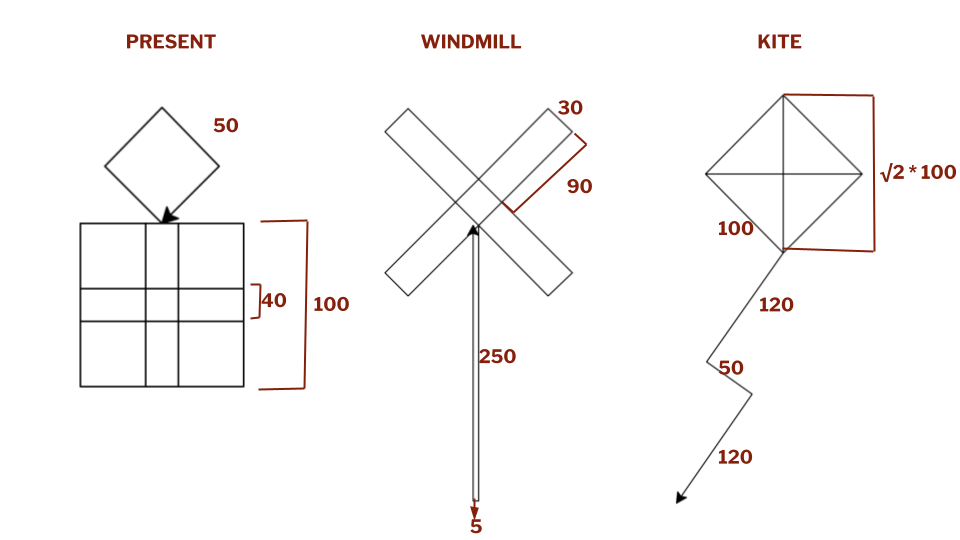
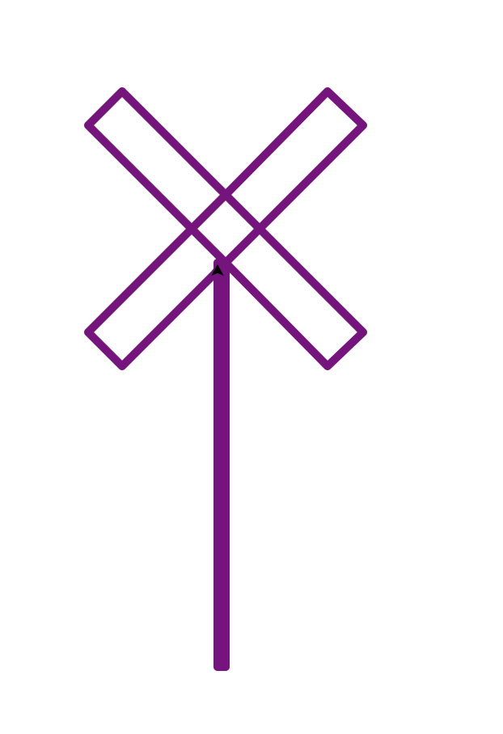

# COSC 101 Homework 2: Fall 2022

The due date for this homework is **Thursday, September 15, 5pm EDT**

## Introduction

This assignment is designed to give you practice with the following new topics: 

- Boolean logic
- Writing conditional statments
- Using modules (Turtle, Math and Random)

It will also require you to apply concepts covered in previous classes, including but not limited to:

- Variables and Assignment
- Using the `input()` and `print()` functions
- Type conversion


## Your assignment

Your task is to complete following steps:

1.  Download the [hw2.zip](https://colgateuniversitycomputerscience.github.io/cosc101website/hw/hw02/hw2.zip) file from the course website and open it. You will see four python files, `hw2_part1.py`, `hw2_part2.py`, `hw2_part3.py`, and `hw2_part4.py` in either the unzipped folder or the Repl project. You are expected to write your programs in these files. You will also see a plain text file `hw2_part5.txt`. You are expected to write your answer to the reflection prompt at the end of the assignment in this file. 
2. Complete `hw1_part1.py`. This file is used in [Part 1](#part-1).
3. Complete `hw1_part2.py`. This file is used in [Part 2](#part-2).
4. Complete `hw1_part3.py`. This file is used in [Part 3](#part-3).
5. (OPTIONAL) Complete `hw1_part4.py`. This file is used in [Part 4](#part-4).
6. Write your response to the reflection question in [Part 5](#part-5) in `hw1_part5.txt`
7. Review the grading criteria at the end of this assignment.
8. Submit your completed programs.

Notice that each starter `.py` file has a header with some information for you to fill in.  Please do so.  Your feedback helps the instructors better understand your experiences doing the homeworks and where we can provide better assistance.

#### Note on using Replit
If you are using **Replit**, you can create a new Repl and upload the files included in hw2.zip to it. You can run the individual .py files in one of two ways:

1. Click on "Shell". Type `python filename.py`. For example, if you wanted to run hw2_part1.py, you would type `python hw2_part1.py`
2. Type `import filename` in the main.py document, and then click the green Run button. If you wanted to run hw2_part1.py, you would type `import hw2_part1`. Note: if you include multiple `import` statements with multiple filenames, Replit will run all of them. 

## Part 1

In the `hw2_part1.py` file, write a program that calculates how much a user owes in federal income taxes. The program should ask a user for their gross income and total deductions (in dollars) and output how much the user owrs in taxes. 

Your program should use the 2022 Single Tax Bracket:

| Rate | Taxable Income Bracket |
|------|------------------------| 
| 10%  | Up to $10,275          | 
| 12%  | $10,276 to $41,775     | 
| 22%  | $41,776 to $89,075     | 
| 24%  | $89,076 to $170,050    |
| 32%  | $170,051 to $215,950   |
| 35%  | $215,951 to $539,900   |   
| 37%  | Over $539,900          |

*Taxable income is gross income minus deductions.*

Note, the tax rate is not applied uniformly for the entire taxable income. For example, someone with a taxable income of $11000 falls under the 12% bracket. However, this person will not pay 12% * 11000 in taxes. Instead, the first $10275 will be taxed at 10%, and only the remaining amount (11000-10275) will be taxed at 12%. You can calculate tax owed by a person with a taxable income of $11000 as follows:

```
10275*0.1 + (11000-10275)*0.12
```

Similarly, someone with a taxable income of $44000 will not pay a flat 22% tax. Instead, their first $10275 will be taxed at 10%, the amounts $10276 to $41775 will be taxed at 12% and only the remaining amount (44000-41775) will be taxed at 22%. You can calculate tax owed by a person with a taxable income of $44000 as follows:

```
10275*0.1 + (41775-10275)*0.12 + (44000-41775)*0.22
```

Below are two examples of inputs that a user might type in and the corresponding correct outputs. 

```
What is your gross income? 98765
What is your total deduction? 12200
Your taxable income is $86565.0
You owe $14661.3 in federal taxes
```


```
What is your gross income? 525600
What is your total deduction? 15000
Your taxable income is $510600.0
You owe $152463.0 in federal taxes
```


## Part 2

In the `hw2_images1.py` file, write a program that creates a custom image based on the user's input. The user is presented with the following choices:

- **Image type**: `present`, `kite`, or `windmill` (see the corresponding images below). 
- **Color**: `black`, `purple`, or `red`. 
- **Line width**: `1`, `5` or `10`. 

Below are the reference images for each type with the dimensions indicated in maroon. 



The user interface for the program should look something like this (the user types in `windmill`, `purple` and `5`):

```
Welcome! I will generate an image for you. 

What type of an image would you like? Your options are a present, a kite or a windmill. 

Image type: windmill

What color would you like the image in? Your options are black, purple or red. 

Color: purple

What line width would you prefer? Your options are 1, 5 or 10. 

Line width: 5

```



#### Extra credit
Add an additional input option `size` which is used to determine the scale of the image (i.e., large, medium or small).


## Part 3

In this part you will build on the image generator in a **new file** `images2.py`. Here you will check for whether the user input a valid option. If the user inputs an invalid option, you should print `You've selected an invalid option. Please re-run the program again and select a valid option.`

Here are three examples invalid input and their corresponding outputs. The first is invalid because the user had a typo in the image type entry. The second is invalid because the user used an uppercase R instead of a lowercase one. The third is invalid because the user selected an invalid value for line width. 

```
Welcome! I will generate an image for you. 

What type of an image would you like? Your options are a present, a kite or a windmill. 

Image type: presnt

You've selected an invalid option. Please re-run the program again and select a valid option.

```

```
Welcome! I will generate an image for you. 

What type of an image would you like? Your options are a present, a kite or a windmill. 

Image type: kite

What color would you like the image in? Your options are black, purple or red. 

Color: Red

You've selected an invalid option. Please re-run the program again and select a valid option.

```

```
Welcome! I will generate an image for you. 

What type of an image would you like? Your options are a present, a kite or a windmill. 

Image type: windmill

What color would you like the image in? Your options are black, purple or red. 

Color: purple

What line width would you prefer? Your options are 1, 5 or 10. 

Line width: 15

```

## Part 4: Extra credit

In this part you will continue build on the image generator in a **new file** `images3.py`. Specifically, you will add an additional image type to your image generator: `surprise`. If the user selects this option, then you will generate a random image. The random image must consist of at least five random steps. At each random step, you must perform the following computations:

1. Select an action (turn left, turn right or move forward)
2. Select a number which determines how much the turtle turns or moves. 
3. Perform the action. 
 
**Reflection for part 4** Are the images this `surprise` option generates interesting? If not, how could you make them more interesting? 

## Part 5: Reflection

Write the response to this reflection prompt in the `hw1_part5.txt` file. You might have noticed that the code your wrote for parts 2 and 3 (and 4 if you attempted it) were repetitive. Section 1.5 in the textbook lists different categories of instructions that are common to every programming language. What kind of instruction/s can make the code you just wrote less repetitive and more concise? Why? 


## Grading

Your assignment will be graded on two criteria:

1. Correctness: this document contains examples for each program. Be sure that you run your program once for each example and make sure it works correctly for each one!  [90%]

    The correctness part of your grade is broken down as follows:

    | Category | Portion of grade |
    |----------|------------------|
    | Part 1   | 30%              |
    | Part 2   | 35%              |
    | Part 3   | 20%              |
    | Part 4   | 0%               |
    | Part 5   | 5%               |

    Note, the extra credit questions are designed to provide you with an opportunity to challenge yourself if you wish to. **You are not required to attempt them.** 

2. Program design and style [10%]: style and program design become increasingly important the more complex your program becomes. For these first programs, adhere to the following guidelines:
  
    - Variable names should be meaningful.
    - Programs should contain at least a few descriptive comments.  Each of the programs for this homework involves multiple conceptual steps and should have comments that indicate to a reader what's going on at a high level.


