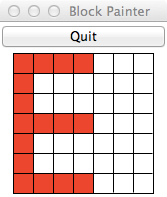

# COSC 101 Homework 3: Fall 2022

The due date for this homework is **Thursday, September 29, 5pm EDT**.

## Introduction

This assignment is designed to give you practice with the following new topic: 

- `for` loops (with `range`)
- Modules

It will also require you to apply concepts covered in previous classes, including but not limited to:

- Variables and Assignment
- Using the `input()` function
- Arithmetic operations
- Conditional expressions and statements

our task is to complete following steps:

1.  Download the [hw3.zip](https://colgateuniversitycomputerscience.github.io/cosc101website/hw/hw03/hw3.zip) file from the course website and open it. You will see five files, `hw3_repeat.py`,`hw3_letters.py`, `hw3_symbol.py`, `hw3_symbol2.py`, and `block_paint.py` in either the unzipped folder or the Repl project. You are expected to write your programs in these files. The Python file `block_paint.py` is a Python module that you will use as part of this assignment. It should always be kept in the same folder as the other files.
2. Complete `hw3_repeat.py`. This file is used in [Part 1](#part-1).
3. Complete `hw3_letters.py`. This file is used in [Part 2](#part-2).
4. Complete `hw3_symbol.py`. This file is used in [Part 3](#part-3).
5. (Optional) Complete `hw3_symbol2.py`. This file is used in [Part 4](#part-4).
6. Review the grading criteria at the end of this assignment.
7. Submit your completed programs.

Notice that each starter `.py` file has a header with some information for you to fill in.  Please do so.  Your feedback helps the instructors better understand your experiences doing the homeworks and where we can provide better assistance.


### Note on using Replit
If you are using **Replit**, you can create a new Repl and upload the files included in hw2.zip to it. You can run the individual .py files in one of two ways:

1. Click on "Shell". Type `python filename.py`. For example, if you wanted to run hw2_part1.py, you would type `python hw2_part1.py`
2. Type `import filename` in the main.py document, and then click the green Run button. If you wanted to run hw2_part1.py, you would type `import hw2_part1`. Note: if you include multiple `import` statements with multiple filenames, Replit will run all of them. 


## Part 1

for the first problem for this homework, you will first ask the user to enter a number. Let call this number m. For all the numbers starting from 0 to m-1, you will then print the word `even` if the number is even and print 'odd' otherwise, all in separate lines. Please write your code in `hw3_repeat.py`. Here is a sample input and output:

```
Enter the number of repetitions: 4
even
odd
even
odd
```

## Part 2

For the second problem for this homework, you will use a Python module called `block_paint` and write code to implement four letters of a *scalable* retro font, like the ones used in 1980's-era digital watches (and celebrated in *minecraft*). This module is included in the homework 4 zip file.

Your program should do the following:

 1. First ask for the scale (size) of the letter to draw.  This number should be a positive odd integer, greater than or equal to 3. Your program must check the user has typed a valid odd number, greater than or equal to 3.
 2. Next, ask the user what letter to draw. The user must enter E, N, Y, or Z. The letters can be either upper or lower case. Your program must check that the user has typed a valid letter.

   - If the user has entered valid inputs, then your program should draw the letter as described below. 
   - If the user entered an invalid input, the program should print a useful error message and *not draw anything*.

Here are a couple examples to show the prompts that the test program (described below) expects, and to show invalid input.  In the following example, an invalid scale is entered (>= 3, but not odd).  Notice that because the scale is invalid the program does not ask for the letter to draw:

    Enter scale: 8 
    8 is an invalid scale.

In the following example, the scale is okay but the letter is not valid:

    Enter scale: 3 
    Enter letter: q 
    I can't draw a q

If the scale and letter are both valid, your program should not print anything else (it should just draw the appropriate letter).

### Using the `block_paint` module

We have provided the `block_paint` module for drawing the retro font letters. To create a window for drawing a letter, you should call the `new_grid` function in the `block_paint` module. This function takes one parameter, which is the scale (width and height) of the window, in blocks, and returns a `BlockPaint` object that can be used for "painting" the blocks in a window. There are two useful methods
available for this object:

1.  `paint(x, y, color)`. This method takes the coordinates and color of
    a block to be painted. Coordinates start at (0,0) at the lower-left
    of a window, and extend to (scale-1,scale-1) at the upper right. The
    color you specify can be a string like `red'`, `'orange'`, `'blue'`,
    or `'green'`. Other standard colors should work, too.

2.  `end()`. Once you are done painting the blocks for a letter, you
    **must** call the `end()` method. Your program will "hang" and not
    work properly if you do not call this function.

A short example of using the `block_paint` module appears at the top of the `hw3_letters.py` template file, and is also shown below. Before attempting to write code to draw the letters, try to run the `hw3_letters.py` program. Your `hw3_letters.py` file **must** be located in the same folder (directory) as the `block_paint.py` file in order for your code to run correctly.  This should "automatically" happen because of both files being contained inside the `.zip` file you downloaded for this homework, but please ensure that that is the case.

The example code that appears at the top of `hw3_letters.py` is designed to draw two parallel vertical lines on the edges of a grid, one blue and one red:

    import block_paint

    # set an arbitrary scale; you should ask the user for the scale
    scale = 13

    # make a new window to draw in
    window = block_paint.new_grid(scale)

    # draw two vertical lines
    for i in range(scale):
        window.paint(0, i, 'red')
        window.paint(scale-1, i, 'blue')

    # all done drawing
    window.end()

### Drawing the letters

Guidelines and hints for drawing the letters are given below, as well as example images of the letters you will need to draw, at two different scales.  **Important detail:** with each letter there is a constraint on the number of `for` loops you are allowed to use.  For full credit, you must abide by these constraints.


**E**:   The letter E should be anchored at the left side of the window, with
    the width of the letter extending to 2/3 the width of the window. For
    example, if the scale is 7, the width of the E should be 7\*2/3=4. As 
    another example, if the scale is 13, the width of the E should be 
    13\*2/3=8. You should have no more than 2 `for` loops in your code to draw
    the E.  

-------------------------------------------- ---------------------------------------------
                  Letter E at scale 7                          Letter E at scale 13
{width="1.5in"}   {width="1.5in"}
-------------------------------------------- ---------------------------------------------

**N**:   The letter N should extend to the corners of the window. You should 
    have no more than 1 `for` loop in your code to draw the N.  

-------------------------------------------- ---------------------------------------------
                  Letter N at scale 7                          Letter N at scale 13
    
-------------------------------------------- ---------------------------------------------


**Y**:   The letter Y should extend to the corners of the window. The two
    angled "struts" at the top of the Y should start at the row *above* the
    middle row and extend to the top corners. You should have no more than 2
    `for` loops in your code to draw the Y.  


 Letter Y at scale 7                          
  

Letter Y at scale 13
  
-------------------------------------------- ---------------------------------------------

**Z**:   The letter Z should extend to the corners of the window. You should 
    have no more than 1 `for` loop in your code to draw the Z.  

-------------------------------------------- ---------------------------------------------
                  Letter Z at scale 7                          Letter Z at scale 13
    
-------------------------------------------- ---------------------------------------------

Lastly, note that if you attempt to draw in a location that is beyond the extent of the window, your program will crash. The crash message will include the line number of your code and the specific coordinate value that caused the problem. In the example trace below, an attempt was made to draw using X coordinate 14 (at line 52 in the program `example_error.py`), which was beyond the edge of the window:

```
Traceback (most recent call last):
  File "example_error.py", line 52, in <module>
    window.paint(i+1, size/2+i, 'red')
  File "block_paint.py", line 64, in paint
    raise InvalidXValue("X dimension {} is invalid".format(x))
block_paint.InvalidXValue: X dimension 14 is invalid
```

## Part 3

For this part, your program should do the following:

 Ask for the scale (size) of the symbol (to be described below) to draw.  This number should be a positive odd integer, greater than or equal to 3. Your program must check the user has typed a valid odd number, greater than or equal to 3.

   - If the user has entered valid input, then your program should draw the symbol as described below. 
   - If the user entered an invalid input, the program should print a useful error message and *not draw anything*.

The program should then draw the symbol. Your program only prompts the user for `size ` and unlike Part 1, there is no need to ask for the name of the symbol as the program will always draw `Symbol`.


**Symbol**:   The symbol consist of a `plus` sign which extends to the sides of the window and whose four corners are connected with diagonal lines (see figures below). 

-------------------------------------------- ---------------------------------------------
                  Symbol at scale 7                          Symbol at scale 13
    
-------------------------------------------- ---------------------------------------------

## Part 4: Extra credit

In this part, you will draw the symbol. You will have exactly the same input question and output as Part 3. But you must use no more than 1 `for` loop in your code to draw the symbol!  Please save your code for this part in `hw3_symbol2.py`.


# Grading

Your assignment will be graded on two criteria:

1. Correctness: this document contains examples for each letter or symbol. Be sure that you run your program once for each example and make sure it works correctly for each one!  [90%]

    The correctness part of your grade is broken down as follows:

    | Category | Portion of grade |
    |----------|------------------|
    | Part 1   | 10%              |
    | Part 2   | 40%              |
    | Part 3   | 40%              |
    | Part 4   | 0%               |


    Note, the extra credit questions are designed to provide you with an opportunity to challenge yourself if you wish to. **You are not required to attempt them.** 

2. Program design and style [10%]: style and program design become increasingly important the more complex your program becomes. For these first programs, adhere to the following guidelines:
  
    - Variable names should be meaningful.
    - Programs should contain at least a few descriptive comments.  Each of the programs for this homework involves multiple conceptual steps and should have comments that indicate to a reader what's going on at a high level.