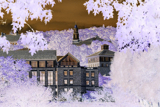

# COSC 101 Homework 6: Fall 2022

The due date for this homework is **Thursday, October 27, 5:00pm**.

This homework will improve your skills with nested `for` loops, functions and modules by having you develop programs that use nested loops to repeat code patterns that are similar but not exactly the same. Your program will uses the `cImage` module, [described in the textbook](https://runestone.academy/runestone/books/published/thinkcspy/MoreAboutIteration/ImageProcessingonYourOwn.html). Specifically, this assignment is designed to give you practice with the following topics:

- Nested for loops
- Functions
- Modules

To get started, download [`hw6.zip`](hw6.zip) and unzip the compressed file to reveal the following files:

- `hw6_images.py` this file will be used for all of your code
- `cImage.py` an image manipulation module described in the textbook and used by your program
- `img` a folder of images you can use to test your `hw6_images.py` program
- `hw6.pdf` this description

Note that all starter files have special headers at the top including form fields that you should fill out before submitting your assignment. Also, do not change the file names as the test program included with this homework (and test programs that we use) assume certain file names.

Open and attempt to run the `hw6_images.py` file. Note that the `cImage.py` module described in the textbook has been included in the zip file for this homework; the `hw6_images.py` file uses this module to manipulate and display the images. Note that to close the image window, you can just click anywhere on it.

You will write all of your code for this part of the homework in the `hw6_images.py` file. Carefully read through all of the comments in the file to make sure you understand what sections of the file you do not need to modify and where your code should go.

We have provided four image file examples that you can work with for this assignment: `house.gif`, `colgate.gif`, `rose.gif`, and `grid.gif`. It is strongly recommended that you test your code with multiple images to help ensure that it works for any image.  Some code has been added to the `main` function that will call the various functions you need to write; you are welcome to modify the code in `main` as you run and test your code.

**Note:** When the `main` function runs, it will display each image result in sequence. To see the next image, click on the current image. Do not click **not** on the X in the corner of the image window).

&nbsp;

You will write **eight functions** that take an image object, create a copy, perform a pixel-by-pixel manipulation, and return the manipulated copy. We have provided three helper functions (`open_image`, `display_image`, and `save_image`) that you can use to test your code. You may write any additional helper functions that you find useful. Below there are descriptions and sample images for each of the required manipulations.

The best way to test your image functions is to modify the `main` function at the bottom of `hw6_images.py`. You can add calls to the various image functions and use the helper functions to display and save the new/modified image.

The code for an example function, `red_filter`, is provided in `hw6_images.py`; images to show the effect of this filter are shown below.

The eight functions you must write are as follows:

### 1. `flip_horizontal`
"Flip" the image horizontally so that pixels on the left column and right column are swapped, pixels on the second column and next-to-last column are swapped, etc

&nbsp;

### 2. `flip_vertical`
"Flip" the image vertically so that pixels on the top row and bottom row are swapped, pixels on the second row and the next-to-last row are swapped, etc

&nbsp;
-->

### 3. `rotate_clockwise`
"Rotate" the image 90 degrees clockwise so that the left edge of the original image 
becomes the top of the rotated image.     

### 4. `to_negative`

Convert the image to its negative. The RGB components of each pixel in the negative image should be 255 minus the corresponding component of the same pixel in the original image. 

### 5. `to_blacknwhite`

Create a black-and-white version of the original image such that edges within the image are colored as black and other pixels as white. The edges are, however, drawn for a given `intensity` value. You may need to manipulate this parameter using trial and error. Your function should have two input parameters, `image` and an integer value representing `intensity`. In the main function, the default value for intensity has been set to 100 for you. Feel free to alter this value if you need to. Hint: detect edges by comparing adjacent pixels. Here are some examples.

### 6. `scale_up`

Create a new image in which each dimension has been doubled.  Note that each pixel in the old image will map to _four_ pixels in the new image (draw this if that's not clear). Each of the four pixels in the new image should have the same color as the pixel from the original image.

&nbsp;

### 7. `scale_down`

Create a new image in which each dimension in the new image is cut in half.  To do this, scale each block of four pixels in the old image down to one pixel in the new image (again, draw this out if that's not clear).  The RGB components of the resulting (new) pixel should be computed using the average of the corresponding components from the four original pixels.

Note that you'll need to be careful about images that have an odd number of rows and/or columns: for those images, you should use as many pixels as possible to compute the averaging (it may only be 2 pixels, or in the worst case just 1).  

&nbsp;

### 8. `leave_color`

Convert all non-red pixels to grayscale. A pixel is considered red if its red channel is more than 125 and its green and blue channels are each less than 125. To convert a pixel to grayscale, set its red, blue, and green channels to the average of these channels in the original pixel.

&nbsp;

## Challenge Problem

Challenge problems are entirely optional extensions to the homework. If you complete them successfully, you are rewarded with a sense of accomplishment and a small number of extra points on the homework. They are intended for students who want to explore a little further; only pursue the challenge problem after you have successfully completed the homework.

For this week, the challenge problem is to create your own image manipulation. For inspiration, you can investigate different filters and manipulations in apps or programs that modify photos. You can also create a new image by combining the various functions you've written for image manipulation.

Here are some specific ideas you could consider:

 - A filter that detects edges and either highlights or only draws detected edges.
 - A kaleidoscope-like filter (think about how to mirror the image in different ways to achieve an interesting affect).
 - A filter to create a swirl effect in the image.
 - Some kind of creative color manipulation.

If you choose to do the challenge problem, please write your additional function in the file `hw6_images.py`. The function should be called `challenge`. Be sure to explain what your function does in the docstring! Have fun!

# Submission Instructions

Please upload only your `hw6_images.py` file. Remember to complete the questions at the top of the file and that the file you submit must have this exact filename.

# Grading

Your assignment will be graded on two criteria:

1. Correctness: Be sure that you run your programs and make sure they work correctly. Be sure to test more than one image to verify that the image transformation works for other inputs, too --- you can be sure that we will do that! [80%]

2. Program design and style [20%]: style and program design become
    increasingly important the more complex your program becomes. For
    these programs, adhere to the following guidelines:

    -   Variable names should be meaningful

    -   Programs should contain at least a few descriptive comments. Do
        *not* comment every line of code with low level explanations of
        what each line does. Focus on high level ideas.

    -   Any functions must have appropriate docstrings
