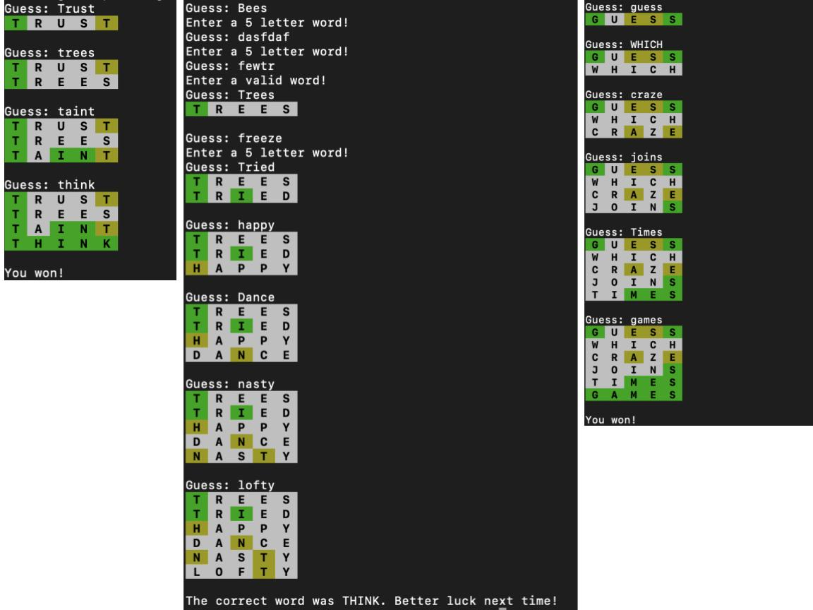

# COSC 101 Homework 7: Fall 2022

Due date: **Thursday, November 3, 5:00pm**

# Introduction

The goal of this homework is to re-create [Wordle](https://www.nytimes.com/games/wordle/index.html) using the following core concepts in Python. 

1. File I/O
2. String methods
3. Accumulator patterns
4. Functions
5. Loops
6. Conditionals


Download the [hw7.zip](https://colgateuniversitycomputerscience.github.io/cosc101website/hw/hw07/hw7.zip) file from the course website. Please write your code in the included template file ``hw7_wordle.py``. This file already imports the `random` module. You do not need to import any other modules or install any other packages. 


Note that the file includes a function for adding a background color to characters (which you will use to indicate correct, partially correct or incorrect guesses).


## Required functionality

Here are the basic guidelines for how your program should behave:

1. The file `sgb-words.txt` (included with this homework) consists of 5757 lines, where each line consists of a single five letter word. Select a random five letter word from this file. The file `hw7_wordle.py` includes two pre-written funtions `format_char` and `select_word` which can be helpful here. 

2. Ask the user for a word. Make sure that the guess is a valid five letter word from the list of words in the `sgb-words.txt` file. *Note: this part should be case-insensitive*

3. Compare the `guess` to the selected word character by character. Each character in `guess` can have only one of three states: it is either fully correct, partially correct or incorrect. For example, consider a case where the original word is `THINK` and the guess is `STONE`. The letter `N` is fully correct because it occurs in the correct position. The letter `T` is partially correct because it is present in both the guess and selected word but in a different position. The letters `S`, `O` and `E` are incorrect. 

4. Print the guess where the background of each letter indidates its state: green for fully correct, yellow for partially correct and white for incorrect. Note that the file `hw7_wordle.py` includes a function that takes in a character, a state and returns a string which will print the character with the correct background color. 

5. Repeat steps 2, 3 and 4 until either the user guesses the word correctly or the user has had **six** guesses. If the user guesses the word correctly, you should print "You won!" and if the user has failed to guess the words after six tries, you should print "Better luck next time!". 

Note the program should end after one game of Wordle has been played -- just like the original game, the user gets only one word at a time! 


## Suggested program structure

The design of the program to play *Wordle* is up to you, but here is a suggested structure.  This is a *suggestion*; if you deviate from it, that's up to you, but for all functions you write you should try to make sure that:

 - any function you write does _one_ thing (i.e., one specific task);
 - any function function you write just takes parameters and returns or prints value(s), but does _not_ modify any global state or global variables; 
 - any function you write is fairly _short_; it is possible to write _all_ the code to play a game in a single function but that's a bad design.


### 1. A function to get a valid guess

A key task in this game is to ask the user for their next guess.  This function should repeatedly ask the user for their guess until they type a valid five letter word from a list of valid words

An example function header might be

```python
def get_guess(valid_words):
  """Get the next player guess."""
```

Some specific suggestions about this function:

 - Use a `while` loop for repeatedly asking the user for new input until valid input is given.  
 - Don't worry about whether the user has guessed a particular word before or not in this function. (See extra credit)

### 2. A function to get the state of the current guess

Another key task is to figure out for every character in the guess whether the character is fully correct, partially correct or incorrect. As a reminder a character is:
- fully correct if it occurs in the same position in the correct word
- partially correct if it occrs in a different position in the correct word
- incorrect if it does not occur in the correct word

It is important to think about how to code the state of the word. Looking at what the function `format_char` requires here can be helpful. 

An example function header might be

```python
def check_guess(guess, correct):
  """Determine the state for every character in the guess"""
```
**A note on repeating letters:** 
Consider a case where the correct word is "THINK" and the guessed word is "TRUST". The orrect state for the first T would be correct, and the last T would be incorrect (because there isn't an additional T in the input). However, do not worry about this at this point. It is ok to consider the state of the second T as being partially correct. 

### 3. A function to format the guess

Once you've determined the state of the guess, it is important to then use these states to format the guess such that each character has the appropriate background color. The pre-written function `format_char` will be helpful here.  
An example function header might be

```python
def format_guess(guess, checked):
  """Returns a string where every character is formatted as per its state"""
```


### 4. A function to play the game:

This function ties together all of the other functions and plays an entire game. A few things to remember:

- A player gets only **six** tries. 
- After every word, the code must print the current guess along with the previous guesses (see format)
- If the player guesses the word correctly, you should print "You won!". If the player fails to guess the word in six tries, you should print "Better luck next time!"

An example function header might be

```python
def play_game(word, valid_words):
  """Plays one game of Wordle given a correct word and list of valid words"""
```

### 5. A main function

In the main function you will create the list of valid words, select a random word and play the game with that random word. 


### Debugging tips

If you go with the suggested structure below, a further strong suggestion is to write a little bit of code at a time (one function at most, but maybe just a couple lines in a function) and test as you go.  Writing most all the code you think you need and testing afterward is a strategy that will often lead to frustration.  Do a little bit at a time. Additionally, test your functions on a known word before you try it on a random word.

## Example output




# Grading

Your assignment will be graded on two criteria:

  1. Correctness (75%): your Wordle game must be implemented correctly.  Refer to the example output above to help ensure that your program works the way it should.

  2. Program design and style (25%): program design is particularly important for this assignment.  Organize your functions so that each one is relatively short does *one* thing and takes few arguments.  Think about how to break down the problem of "playing Wordle" into smaller subtasks.  And as usual:

     * Functions should have meaningful docstrings
     * Variable names should be meaningful
     * Programs should contain at least a few descriptive comments.  Do *not* comment every line of code with low level explanations of what each line does.  Focus on high level ideas.
     * All code should be structured so that the logic is clear and easy to follow.
     * There should be *no global variables*.  Any information needed inside a function should be passed as parameters; anything done by a function that needs to be used by the caller of the function should be returned from the function.


# Testing

There are no automated tests for this homework.  You'll need to run your code and test it in a variety of ways to ensure that it behaves according to the specifications above.  You are strongly encouraged to write `doctest` tests for your functions, but you are not required to do so.


# Challenge problems

There are two challenge problems for this homework. Create a separate file called `hw7_challenge.py` if you are attempting these problems.

### Dealing with repeated letters

Consider the case described above where the correct word is "THINK" and the guessed word is "TRUST". As specified earlier, the correct state for the first T would be correct, and the last T would be incorrect (because there isn't an additional T in the input). Currently your code treats the second T as being partially correct. Edit your code to get the correct behavior where the second T is incorrect. 


### Keeping track of guessed words

Currently your code does not check if the user has already guessed a certain word. Edit your code such that the following message is printed if the user guesses the same word twice: "You have already tried this word. Please enter a new word!"