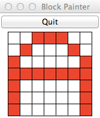
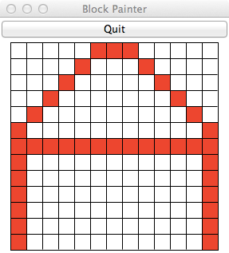
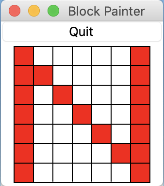
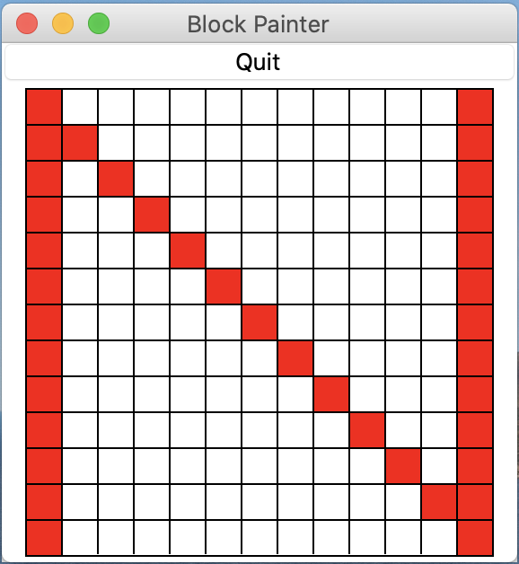
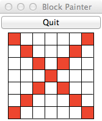
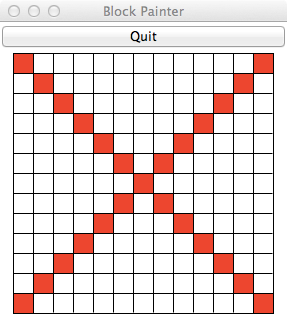
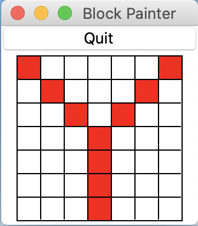
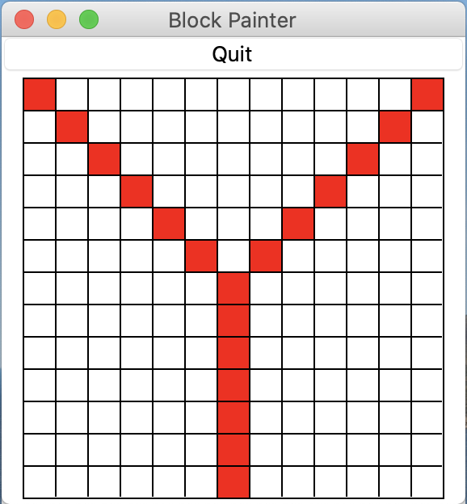
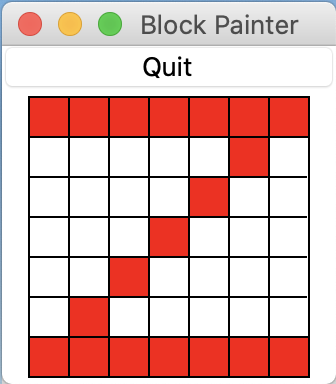
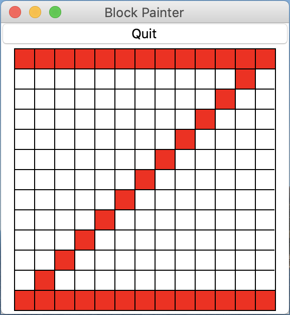

# COSC 101 Homework 4: Spring 2020

The due date for this homework is **Thursday, February 20, 11:00pm**.

This homework will improve your skills with `for` loops (with `range`) and `if` statements by having you develop programs that use loops and conditionals to repeat code patterns that are similar but not exactly the same. Specifically, this assignment is designed to give you practice with the following topics:

- Modules
- Conditional expressions and statements
- `for` loops over integers with `range`
- Accumulator pattern

As usual, we encourage you to start early.

There are two programs to complete as part of this homework: `hw4_letters.py` and `hw4_email.py`.  Each of these is described below.

Download [`hw4.zip`](hw4.zip) and unzip the compressed file to reveal the following files:

- `hw4_letters.py`: this is where all the code you write for the [Retro Font](#retro-font) problem will go
- `block_paint.py`: a Python module that you will use as part of this assignment
- `hw4_email.py`: this is where all the code you write for the [Email Address Validator](#email-address-validator) problem will go
- `hw4tester.py`: a Python program for running tests on your `hw4_email.py`
- `hw4.pdf`: this description

# Retro Font

For the first problem for this homework, you will use a Python module called `block_paint` and write code to implement four letters of a *scalable* retro font, like the ones used in 1980's-era digital watches (and celebrated in *minecraft*). This module is included in the homework 4 zip file.

Your program should do the following:

 1. First ask for the scale (size) of the letter to draw.  This number should be a positive odd integer, greater than or equal to 3. Your program must check the user has typed a valid odd number, greater than or equal to 3.
 2. Next, ask the user what letter to draw. The user must enter E, N, Y, or Z. The letters can be either upper or lower case. Your program must check that the user has typed a valid letter.

   - If the user has entered valid inputs, then your program should draw the letter as described below. 
   - If the user entered an invalid input, the program should print a useful error message and *not draw anything*.

Here are a couple examples to show the prompts that the test program (described below) expects, and to show invalid input.  In the following example, an invalid scale is entered (>= 3, but not odd).  Notice that because the scale is invalid the program does not ask for the letter to draw:

    Enter scale: 8 
    8 is an invalid scale.

In the following example, the scale is okay but the letter is not valid:

    Enter scale: 3 
    Enter letter: q 
    I can't draw a q

If the scale and letter are both valid, your program should not print anything else (it should just draw the appropriate letter).

## Using the `block_paint` module

We have provided the `block_paint` module for drawing the retro font letters. To create a window for drawing a letter, you should call the `new_grid` function in the `block_paint` module. This function takes one parameter, which is the scale (width and height) of the window, in blocks, and returns a `BlockPaint` object that can be used for "painting" the blocks in a window. There are two useful methods
available for this object:

1.  `paint(x, y, color)`. This method takes the coordinates and color of
    a block to be painted. Coordinates start at (0,0) at the lower-left
    of a window, and extend to (scale-1,scale-1) at the upper right. The
    color you specify can be a string like `red'`, `'orange'`, `'blue'`,
    or `'green'`. Other standard colors should work, too.

2.  `end()`. Once you are done painting the blocks for a letter, you
    **must** call the `end()` method. Your program will "hang" and not
    work properly if you do not call this function.

A short example of using the `block_paint` module appears at the top of the `hw4_letters.py` template file, and is also shown below. Before attempting to write code to draw the letters, try to run the `hw4_letters.py` program. Your `hw4_letters.py` file **must** be located in the same folder (directory) as the `block_paint.py` file in order for your code to run correctly.  This should "automatically" happen because of both files being contained inside the `.zip` file you downloaded for this homework, but please ensure that that is the case.

The example code that appears at the top of `hw4_letters.py` is designed to draw two parallel vertical lines on the edges of a grid, one blue and one red:

    import block_paint

    # set an arbitrary scale; you should ask the user for the scale
    scale = 13

    # make a new window to draw in
    window = block_paint.new_grid(scale)

    # draw two vertical lines
    for i in range(scale):
        window.paint(0, i, 'red')
        window.paint(scale-1, i, 'blue')

    # all done drawing
    window.end()

## Drawing the letters

Guidelines and hints for drawing the letters are given below, as well as example images of the letters you will need to draw, at two different scales.  **Important detail:** with each letter there is a constraint on the number of `for` loops you are allowed to use.  For full credit, you must abide by these constraints.

<!-- **A**:   The letter A should consume the full width of the window. The two
    angled "struts" to draw the peak of the A should start at the row
    *above* the middle row and meet toward the top. Note that you will
    need to draw one single block at the very top-middle of the peak,
    since the two struts won't quite reach the top middle. You should
    have no more than 2 `for` loops in your code to draw the A.

-------------------------------------------- ---------------------------------------------
            Letter A at scale 7                          Letter A at scale 13
 {width="1.5in"}   {width="1.5in"}
-------------------------------------------- --------------------------------------------- -->

**E**:   The letter E should be anchored at the left side of the window, with
    the width of the letter extending to 2/3 the width of the window. For
    example, if the scale is 7, the width of the E should be 7\*2/3=4. As 
    another example, if the scale is 13, the width of the E should be 
    13\*2/3=8. You should have no more than 2 `for` loops in your code to draw
    the E.  

-------------------------------------------- ---------------------------------------------
                  Letter E at scale 7                          Letter E at scale 13
{width="1.5in"}   {width="1.5in"}
-------------------------------------------- ---------------------------------------------

**N**:   The letter N should extend to the corners of the window. You should 
    have no more than 1 `for` loop in your code to draw the N.  

-------------------------------------------- ---------------------------------------------
                  Letter N at scale 7                          Letter N at scale 13
{width="1.5in"}   {width="1.5in"}
-------------------------------------------- ---------------------------------------------

<!-- **X**:   The letter X should extend to the corners of the window. You should
    have no more than 1 `for` loop in your code to draw the X.

      -------------------------------------------- ---------------------------------------------
                  Letter X at scale 7                          Letter X at scale 13
       {width="1.5in"}   {width="1.5in"}
      -------------------------------------------- --------------------------------------------- -->

**Y**:   The letter Y should extend to the corners of the window. The two
    angled "struts" at the top of the Y should start at the row *above* the
    middle row and extend to the top corners. You should have no more than 2
    `for` loops in your code to draw the Y.  

-------------------------------------------- ---------------------------------------------
                  Letter Y at scale 7                          Letter Y at scale 13
{width="1.5in"}   {width="1.5in"}
-------------------------------------------- ---------------------------------------------

**Z**:   The letter Z should extend to the corners of the window. You should 
    have no more than 1 `for` loop in your code to draw the Z.  

-------------------------------------------- ---------------------------------------------
                  Letter Z at scale 7                          Letter Z at scale 13
{width="1.5in"}   {width="1.5in"}
-------------------------------------------- ---------------------------------------------

Lastly, note that if you attempt to draw in a location that is beyond the extent of the window, your program will crash. The crash message will include the line number of your code and the specific coordinate value that caused the problem. In the example trace below, an attempt was made to draw using X coordinate 14 (at line 52 in the program `example_error.py`), which was beyond the edge of the window:

```
Traceback (most recent call last):
  File "example_error.py", line 52, in <module>
    window.paint(i+1, size/2+i, 'red')
  File "block_paint.py", line 64, in paint
    raise InvalidXValue("X dimension {} is invalid".format(x))
block_paint.InvalidXValue: X dimension 14 is invalid
```


# Email Address Validator

Valid internet email addresses must have a particular format, their sequences of characters must follow a specific pattern. Forms on the web often check if email addresses are valid. This exercise imitates such validation, but is a simplification of reality. 

In the file `hw4_email.py` you will write a program that analyzes a string to determine the validity of an email address.

A valid email address consists of a *local* part, followed by `'@'`, followed by a *domain* part. We define an email address to be valid if the string has the following three properties.

1. One `@` is present (zero `@` or more than one `@` is invalid).
2. At least one character forms the local part.
3. At least three characters forms the domain part.
4. Only letters, numbers, and periods are allowed in the domain part.

For example:

String | Valid? | local | domain | 
------ | ------ | ----- | ------ | 
`user@localserver` |  Yes  |  `user` |  `localserver` | 
`example@colgate.edu` | Yes | `example` | `colgate.edu` | 
`a@b.c` | Yes | `a` | `b.c` |
`special?!@.com` | Yes | `special?!` | `.com` |
`Abc.example.com` | No |  |  |
`A@b@c@example.com` | No |  |  |
`example@b` | No |  |  | 
`@host` | No |  |  |
`a_user@a_domain` | No |  |  |


Your program should first ask the user to enter an email address and then should print a statement indicating whether the email address is valid or not. 

If the email address is valid the program should also print the following information:

 * the local part (characters before the `@`),
 * the domain part (characters after the `@`), 
 * if the email address is from the Colgate domain (i.e., the domain part is equal to `colgate.edu`) you should print `'From COLGATE!'`

Think about how to break down the problem into manageable parts so as to implement and test one at the time. You should build your program incrementally. 

Hint: you can import the `string` module in Python and check whether a given character is contained within pre-defined strings of all letters (`string.ascii_letters`) and numbers (`string.digits`).  See the [string module documentation](https://docs.python.org/3/library/string.html) for more information.

<!--
Hint: You can use Python's built-in string function [`str.isalnum()`](https://docs.python.org/3.8/library/stdtypes.html?highlight=isnumeric#str.isalnum) to test if a string contains only letters or digits.
-->

Here are several examples.  Your program's output should look **exactly** like the examples provided below (the `hw4tester.py` program looks for output matching the following).
```
Enter an email: user@localserver
Valid email
Local part: user
Domain part: localserver
```
```
Enter an email: example@colgate.edu
Valid email
Local part: example
Domain part: colgate.edu
From COLGATE!
```
```
Enter an email: a@b.c
Valid email
Local part: a
Domain part: b.c
```
```
Enter an email: special?!@.com
Valid email
Local part: special?!
Domain part: .com
```
```
Enter an email: Abc.example.com
Invalid email
```
```
Enter an email: A@b@c@example.com
Invalid email
```
```
Enter an email: @host
Invalid email
```
```
Enter an email: a_user@a_domain
Invalid email
```

# Testing

There are **two** separate files that can be used to test the two programs for this homework.

* There are some tests embedded in the `block_paint.py` module itself that you can use to help verify the correctness of the block letters program (part 1).  As with other tests provided for you, please note that the test program is **NOT** a complete test.  You will still need to take responsibility for thoroughly testing your code before submitting.  

* There are tests in `hw4tester.py` for the `hw4_email.py` program.  Again, please note that the tests in this file are **NOT** comprehensive.  You will still need to take responsibility for thoroughly testing your code before submitting. However, our hope is that this test program will at least catch minor errors and make it easier for our grading process and more likely for you to receive full credit.


To run the tests in these files you'll need to do the following:

1. Open `block_paint.py` in IDLE to run the tests for `hw4_letters.py`, or open `hw4tester.py` to run the tests for `hw4_email.py`.  You'll need to make sure that the tester files are in *exactly* the same folder as your program files.

2. In IDLE, select `Run` -> `Run module`

3. Read the test messages that are printed and revise your work accordingly.  If the output of your program does not precisely match the expected output, a test will fail.  Note that if your letter is not drawn exactly as specified, a text rendering of the correct letter and the letter your program drew will be shown (i.e., no separate window to show the drawing will be shown).

In the case of `hw4_letters.py`, in addition to running the tests provided, you should visually verify that the letters are drawn as required (comparing with the images above).  You should also verify that you are abiding by the constraints on the number of `for` loops in your solution(s).

# Submission Instructions

Please upload two Python files: `hw4_letters.py` and `hw4_email.py` to [Moodle](https://moodle.colgate.edu) under your course section's homework 4.

Please also remember to complete the questions at the top of the `hw4_letters.py` and `hw4_email.py` files.


# Grading

Your assignment will be graded on two criteria:

1. Correctness: this document contains details for how you must complete the two programs that are part of this homework.  For each part, be sure that you run your program once for each example provided above and to make sure it works correctly for each one.  Verify also that you adhere to the requirements regarding number of `for` loops for the block letter program. [80%]

    The correctness part of your grade is broken down as follows:

    | Category | Portion of grade |
    | --- | --- |
    | Letters E, N, Y, and Z are drawn correctly (`hw4_letters.py`) using the specified number of `for` loops | 40% |
    | Email addresses are correctly classified as valid or invalid (`hw4_email.py`) | 40% |

2.  Program design and style \[20%\]: style and program design become
    increasingly important the more complex your program becomes. For
    these programs, adhere to the following guidelines:

    -   Variable names should be meaningful

    -   Programs should contain at least a few descriptive comments. Do
        *not* comment every line of code with low level explanations of
        what each line does. Focus on high level ideas.

    -   The if statements should be structured so that the logic is
        clear and easy to follow.


# Challenge problem

Create additional letters!  You can decide how they should look in their blocky-ness.  In particular, try `A`, `K`, `X` and any others you think will be interesting.  Try to **minimize the number of `for` loops** in your solutions.  
